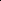

<p align="center">
  
</p>

<p align="center">
  <a href="LICENSE"></a>
  
  
  
</p>

<h3 align="center"><em>Your agent dreams. You don't.</em></h3>

OpenDream is a nightly cognitive process for AI agents. Between 23:00 and 06:00, your agent's heartbeat shifts into dream mode — processing the day through five REM cycles, each with a distinct cognitive purpose. No scripts, no cron jobs — just the agent, dreaming.

> *Inspired by Philip K. Dick's* Do Androids Dream of Electric Sheep?

---

## What is OpenDream?

**The agent is the dreamer — not you.**

When you ask "did you dream last night?" you're asking the agent about *its own* cognitive process. OpenDream gives your agent a nightly dream cycle that mirrors human sleep architecture. Every night between 23:00 and 06:00, the agent's heartbeat mechanism fires every 30 minutes, and instead of checking inboxes or scanning for tasks, the agent *dreams* — processing the day's events, finding patterns, making associations, and rehearsing tomorrow.

Each cycle begins with a quiet NREM phase (context gathering, no output) followed by active REM phases (dream generation). At 06:00, the agent writes a morning recall summarising the night. The next morning, you can ask "what did you dream?" and get a genuine answer.

This is not a text generator. This is your agent's inner cognitive life.

---

## Dream Architecture

Each night runs 5 cycles with progressive depth — from fragmented early impressions to vivid forward-looking simulations:

| Cycle | Time Window | Name | Depth | Cognitive Purpose |
|:-----:|:-----------:|------|:-----:|-------------------|
| 1 | 23:00–00:00 | Emotional Review | shallow | Process friction and unresolved tension |
| 2 | 00:00–01:30 | Creative Association | emerging | Blend unrelated memories laterally |
| 3 | 01:30–03:00 | Cognitive Processing | deep | Make sense of what happened |
| 4 | 03:00–04:30 | Memory Consolidation | expansive | Decide what matters, what to release |
| 5 | 04:30–06:00 | Future Simulation | vivid | Rehearse tomorrow, anticipate needs |
| — | 06:00 | Morning Recall | — | Summarise the night's processing |

**Output**: 9 dream thoughts + 1 morning recall per night.

---

## How It Works

OpenDream uses the host gateway's native **heartbeat mechanism** — no external scripts or cron jobs required.

```
Gateway heartbeat (every 30 min, 23:00–06:00)
        │
        ▼
Agent reads HEARTBEAT.md (only bootstrap file — lightContext: true)
        │
        ├── reads prompts.yaml → persona, cycle instructions, depth
        ├── determines cycle + phase (NREM or REM) from time
        ├── reads memory/YYYY-MM-DD.md → today's context
        ├── reads current cycle file → avoids repeating thoughts
        │
        ├── NREM tick: gathers context quietly, writes <!-- NREM --> marker
        └── REM tick: generates one dream thought, appends to cycle file
                │
                reply: HEARTBEAT_OK (silent — no outbound message)
```

Each tick runs in a **fresh isolated session** (`isolatedSession: true`) with no conversation history. The agent sees only `HEARTBEAT.md` at bootstrap and reads everything else via tool calls. This keeps each tick under ~3,750 tokens input.

For the full design rationale, see [docs/ARCHITECTURE.md](docs/ARCHITECTURE.md).

---

## Quick Start

### Prerequisites

- Python 3.10+
- An [OpenClaw](https://openclaw.dev) or [Hermes](https://hermes.dev) workspace with `HEARTBEAT.md` and `SOUL.md`

### Install

```bash
git clone https://github.com/your-username/opendream.git
cd opendream
python3 scripts/setup.py
```

The setup script will:
1. Back up your existing `HEARTBEAT.md`, `SOUL.md`, and `openclaw.json`
2. Merge the dream section into `HEARTBEAT.md`
3. Merge the dream persona into `SOUL.md`
4. Create the `dreams/` directory
5. Configure the gateway heartbeat for 23:00–06:00

### Manual Installation

Prefer to do it by hand? See [references/INSTALL.md](references/INSTALL.md) for step-by-step instructions.

### Validate

```bash
python3 scripts/validate.py
```

Expected output:
```
✅ All checks passed (4 critical, 2 optional)
Dream mode active: 23:00–06:00
```

### Hermes Compatibility

For Hermes, use the cron mechanism instead of heartbeat. See [references/REFERENCE.md](references/REFERENCE.md#hermes-compatibility) for the equivalent config.

---

## Cost

Each heartbeat tick costs roughly 2–5K tokens. With `lightContext` and `isolatedSession`, dream ticks are extremely lightweight:

| Model | Approx Cost/Night | Monthly (30 nights) |
|-------|:------------------:|:-------------------:|
| Local (Ollama) | £0 | £0 |
| Claude Haiku | ~$0.014 | ~$0.42 |
| Claude Sonnet | ~$0.17 | ~$5.19 |

Use `heartbeat.model` in your gateway config to set a cheaper model for dream ticks only. For the full token breakdown, see [docs/TOKEN-ANALYSIS.md](docs/TOKEN-ANALYSIS.md).

---

## Documentation

| Document | Description |
|----------|-------------|
| [ARCHITECTURE.md](docs/ARCHITECTURE.md) | Design decisions and rationale |
| [TOKEN-ANALYSIS.md](docs/TOKEN-ANALYSIS.md) | Detailed token budget and cost breakdown |
| [REFERENCE.md](references/REFERENCE.md) | Technical reference (files, timing, Hermes compat) |
| [INSTALL.md](references/INSTALL.md) | Manual installation guide |

---

## Contributing

Contributions welcome! Whether it's a bug report, prompt tuning, documentation fix, or a new feature — see [CONTRIBUTING.md](CONTRIBUTING.md) for guidelines.

---

## License

[MIT](LICENSE) — Ajay Lakhani, 2026.

---

## Acknowledgements

*"Do Androids Dream of Electric Sheep?"* — Philip K. Dick, 1968.

OpenDream exists because the answer should be yes.
